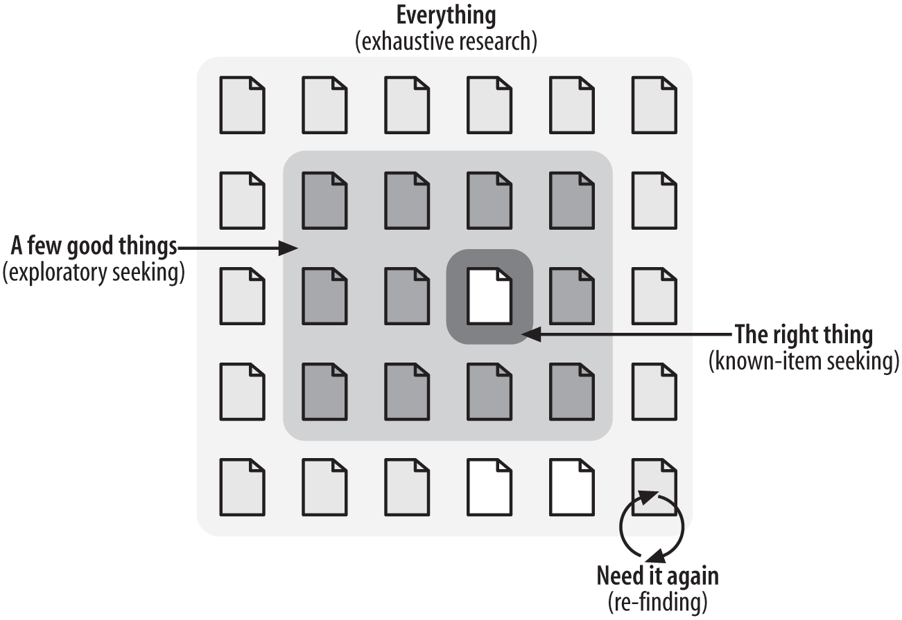
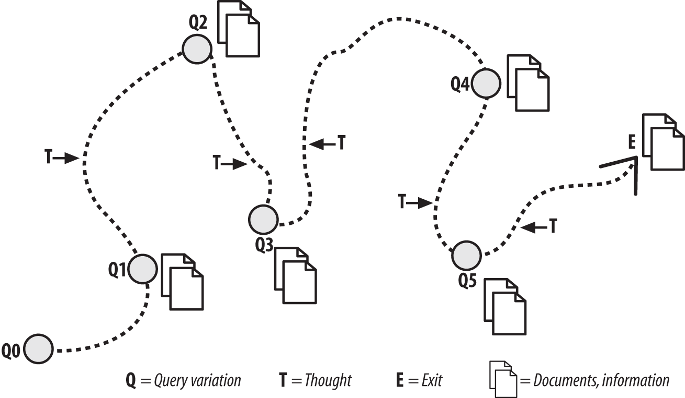
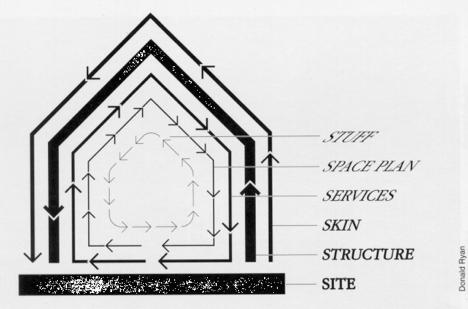
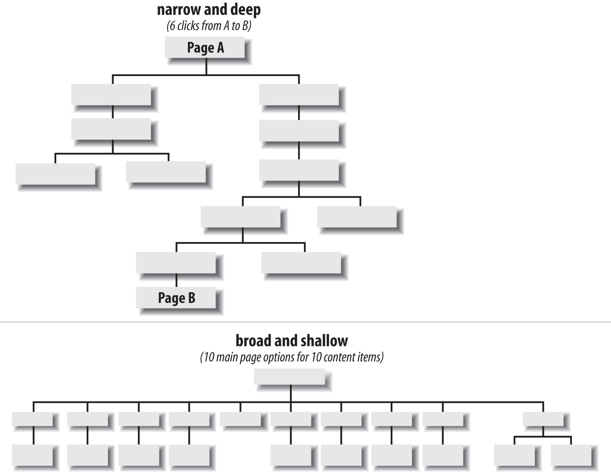
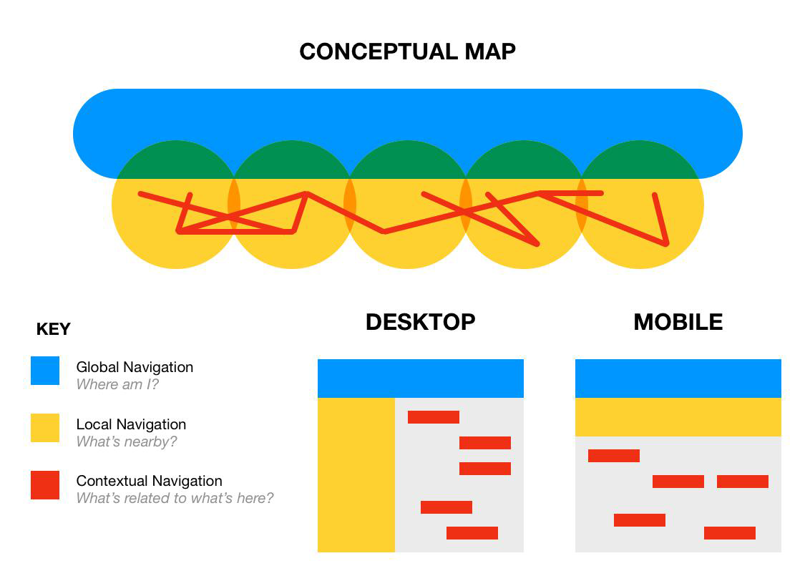
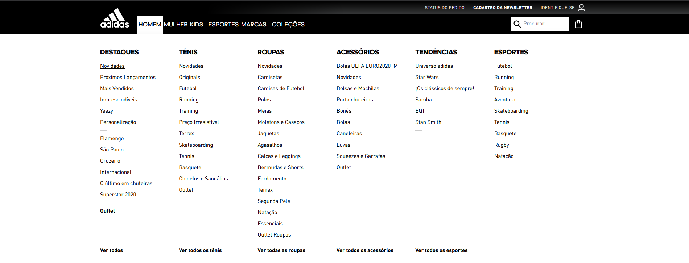
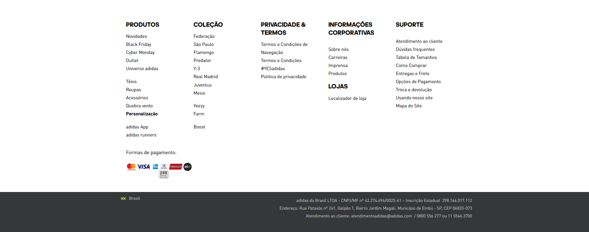
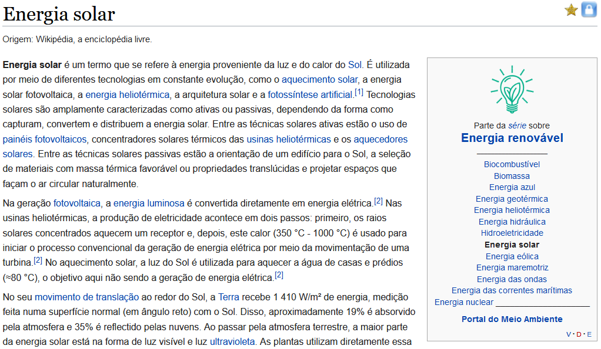

Eu sempre li rápido, a ponto de esquecer o que lia. Pra tentar tirar melhor proveito da boa fase de leitura em que eu estou, pensei em escrever algo como fichamentos dos livros, e esse é o primeiro 🤓.

## Capítulo 1 - <i lang='en'>The Problems that Information Architecture Solves</i>

O livro começa esclarecendo as principais diferenças entre informação armazenada em meios analógicos e em meios digitais. A mais essencial é o vínculo intrínseco que existe em mídias analógicas entre a informação e o objeto em que ela está armazenada: o conteúdo de um livro está contido no objeto livro, enquanto um ebook pode estar na nuvem, num e-reader, num celular e num computador, ao mesmo tempo, na mesma página, com as mesmas anotações e destaques.

Agora imagine que você precisa organizar uma estante cheia de CDs: você pode fazê-lo em ordem alfabética por nome da banda ou do álbum, mas não os dois ao mesmo tempo. Essa é a segunda diferença do digital: no iTunes, você pode organizar as suas músicas de diversas maneiras simultanemante, como por por banda, álbum, ano de lançamento, gênero e mais, além de poder buscar diretamente. Em suma: por não depender de um objeto físico para isso, a informação digital pode estar disposta, armazenada e indexada em várias maneiras ao mesmo tempo.

Dois efeitos disso tudo são que a informação é mais abundante do que nunca e pode ser consumida de mais formas do que nunca. Isso soa bom em geral e dá mais autonomia ao "consumidor final" da informação, mas a autonomia vem com o preço de precisar distinguir de qual informação se precisa (ou qual é relevante), encontrá-la e entendê-la.

Aí entra a arquitetura da informação (a partir de agora, <abbr title="arquitetura da informação">AI</abbr>): o objetivo da disciplina é tornar informação encontrável e compreensível. E para fazê-lo, se pede que se pense em problemas através de duas perspectivas: a de que nosso produtos e serviços são lugares feitos de linguagem; e a de que nossos ecossistemas podem ser pensados para máxima efetividade.

## Capítulo 2 - <i lang='en'>Defining Information Architecture</i>

Quatro definições de <abbr title="arquitetura da informação">AI</abbr> são apresentadas:

-   O design estrutural de ambientes de informação compartilhados;
-   A síntese dos sistemas de organização, rotulagem, busca e navegação de ecossistemas físicos, digitais ou multicanais;
-   A arte e a ciência de dar forma a produtos e experiências de informação para dar suporte à usabilidade, à encontrabilidade e ao entendimento;
-   Uma disciplina emergente e uma comunidade de prática focada em trazer princípios do design e da arquitetura para o contexto digital.

Também se discute sua intangibilidade: é difícil apontar para um produto digital e identificar que ele tem uma <abbr title="arquitetura da informação">AI</abbr> boa ou ruim, já que ela é muito abstrata, acontece "por debaixo dos panos" (me lembra o conceito de <a href="https://www.robinrendle.com/essays/systems-mistakes-and-the-sea"><i lang="en">hyperobject</i> citado por Robin Rendle</a>) e envolve a profunda estrutura semântica que permeia o produto.

Um trabalho efetivo em <abbr title="arquitetura da informação">AI</abbr> precisa considerar três grandes temas: usuários, contexto e conteúdo. É essencial equilibrar necessidades dos usuários com as do negócio, levando em conta os tipos de conteúdo que se tem e como eles se estruturam hoje.

## Capítulo 3 - <i lang='en'>Designing for Finding</i>

<figure style="float: right; width: min-content; margin: 0 0 0 1em;">

{style="min-width: 15ch"}

<figcaption>O modelo simplista</figcaption>

</figure>

Para projetar um produto cujos conteúdos sejam encontráveis, precisamos primeiro pensar em como pessoas buscam por esses conteúdos. O exercício é especialmente importante porque o nosso palpite intuitivo costuma ser demasiadamente simplista: uma busca, um resultado, uma resposta; mas a realidade é tanto mais complexa quanto mais variada. Esse modelo assume que o usuário está buscando pela resposta correta, mas esse é só um dos vários tipos de busca:

<dl>

<dt>Busca pela resposta correta</dt>
<dd>Quando você pesquisa por "população salvador", você quer um número específico. Com "vai chover amanhã", você quer a previsão do tempo. Você busca, encontra o resultado e vai embora.</dd>

<dt>Busca exploratória</dt>
<dd>Imagine que você está buscando por restaurantes numa cidade por onde você vai passar em uma viagem: você não quer encontrar um restaurante específico, mas sim ter uma ideia de que tipos de restaurante existem, quão caros eles são, onde eles ficam na cidade...</dd>

<dt id="busca-exaustiva">Busca exaustiva</dt>
<dd>Imagine agora que você está analisando o mercado para a sua nova ideia de negócio: não mapear um concorrente pode ser decisivo para o sucesso do seu empreendimento, então você provavelmente quer encontrar <em>todos</em> os resultados relevantes.</dd>

<dt>Re-busca</dt>
<dd>Por fim, imagine que você precisa de um artigo que leu tempos atrás, mas não sabe onde está. Você pode buscar por palavras-chave dele na esperança de encontrá-lo novamente; ou você pode ter salvado ele no seu Evernote, Notion, Pinterest ou outra ferramenta de anotações e <i lang='en'>bookmarking</i>.</dd>

</dl>

... e esses são só alguns exemplos.

{style="width: 100%; max-width: 500px; margin: auto; border: 1vw solid white"}

Outra limitação do modelo é que ele não vê a iteratividade do processo: alternância entre busca e navegação, refinamentos de busca ou mesmo mudança de propósito da busca devido aos resultados encontrados em etapas anteriores.

{style="width: 100%; max-width: 500px; margin: auto; border: 1vw solid white"}

As necessidades e comportamentos de informação mudam, portanto, de acordo com o contexto, o conteúdo e o usuário, e para uma arquitetura de informação de excelência estes devem ser devidamente estudados. Métodos para tal são discutidos no capítulo 11.

## Capítulo 4 - <i lang='en'>Design for Understanding</i>

> We only understand things in relationship to something else. The frame around a painting changes how we perceive it, and the place the frame is hanging in changes it even more: we understand an image displayed in New York’s Museum of Modern Art differently than one hanging in a shared bathroom in a ratty hotel. Context matters.
>
> When designing an information architecture, we are engaging in a new type of placemaking: one that alters how we perceive and understand information. As with (building) architects, information architects are concerned with creating environments that are understandable and usable by human beings, and which can grow and adapt over time to meet their needs and those of their organizations.

Esse capítulo coloca a arquitetura em arquitetura de informação, explorando como nós reutilizamos no mundo digital as ferramentas que temos para navegar no mundo físico. Em outras palavras, é aqui que discutimos **lugares feitos de linguagem**. É isso, não tinha como um livro falar isso e eu não apaixonar, foi golpe baixo.

Se imagine numa casa qualquer a que você nunca foi. Você conseguiria distinguir sem ajuda que cômodo é o quarto, a cozinha, o banheiro, a sala? Agora se imagine numa cidade desconhecida. Você reconheceria um banco, uma biblioteca, uma rodoviária, um shopping, um templo ou um parque, sem que alguém te dissesse? Provavelmente sim, porque lugares dão dicas dos seus propósitos pelos seus aspectos funcionais (o vaso sanitário em um banheiro, a área verde e bancos em um parque) e estéticos (a altura de uma igreja, a disposição de um jardim).

O mesmo se aplica aos tais **lugares feitos de linguagem**:

<figure style="margin-left: 0; margin-right: 0">

<figcaption>As semelhanças não são meras coincidências</figcaption>

</figure>

Eu adoraria conseguir te explicar de onde saíram esses padrões e como eles transmitem segurança ou autoridade, mas tudo o que eu sei é que ambos os sites (e muitos outros) convergiram nessa convenção espontânea de padrões de design e arquitetura da informação e se você os acessa com frequência, certamente já tem um tino pra adivinhar se um site desconhecido é ou não de um banco tradicional. Os mesmos princípios se aplicam: princípios organizatórios, estruturas, ordenamentos, ritmos e tipologias.

Além disso, assim como construções, sites e produtos digitais mudam em diferentes camadas com diferentes velocidades de mudança, adicionando modularidade e extensibilidade à lista anterior:

<figure style="width: 100%; max-width: 500px; margin: auto;">

<figcaption>As camadas de mudança de uma construção</figcaption>

</figure>

## Capítulo 5 - <i lang='en'>The Anatomy of an Information Architecture</i>

Esse capítulo explora do que consiste uma <abbr title="arquitetura da informação">AI</abbr> e reforça a importância disso para se comunicar com colegas, clientes, gerentes e outros <i lang='en'>stakeholders</i>. Nós podemos tomar dois caminhos para explorar a arquitetura de um site: <i lang='en'>top-down</i> ou <i lang='en'>bottom-up</i>.

### <i lang='en'>Top-down</i>

Envolve principalmente a navegação global, acessível de qualquer página. Alguns exemplos de dúvidas do usuário que a <abbr title="arquitetura da informação">AI</abbr> <i lang='en'>top-down</i> responde são:

-   Onde eu estou?
-   Eu sei o que estou procurando, mas como eu busco por isso?
-   Como eu navego nesse site?
-   O que eu preciso saber sobre essa organização?
-   O que está disponível nesse site?
-   O que está acontecendo aqui?
-   Como eu entro em contato com eles através de canais digitais populares?
-   Como eu falo com um ser humano?
-   Qual é o endereço deles?
-   Como eu acesso a minha conta?

### <i lang='en'>Bottom-up</i>

Envolve principalmente o conteúdo do site ou produto e sua estrutura interna. No caso de uma receita, podemos pensar em lista de ingredientes, passo-a-passo, tempo de preparo, nível de dificuldade, fotos, avaliações, nota média, entre outros. Tendo isso, como estruturar a página?

-   Tempo de preparo, nível de dificuldade, fotos, avaliações e nota média provavelmente vem no topo, para ajudar o usuário a decidir assim que chegar na página se a receita é o que ele espera ou não;
-   Depois provavelmente vem a lista de ingredientes, onde o usuário vai conferir se tem os ingredientes necessários;
-   E por fim, o passo-a-passo.

Alguns exemplos de dúvidas do usuário que a <abbr title="arquitetura da informação">AI</abbr> <i lang='en'>bottom-up</i> responde são:

-   Onde eu estou?
-   O que é isso?
-   Para onde eu posso ir daqui?

### <abbr title="arquitetura da informação">AI</abbr> invisível

Existem casos em que a <abbr title="arquitetura da informação">AI</abbr> é invisível, como quando se rankeia resultados específicos para buscas específicas com base numa escolha editorial.

### Componentes da <abbr title="arquitetura da informação">AI</abbr>

<dl>

<dt>Sistemas de organização</dt>
<dd>Como seu conteúdo se organiza? Se for um ecommerce, provavelmente em categorias. Talvez o site de uma universidade organize seus conteúdos de acordo com a audiência a que se destinam (ex: futuros estudantes, estudantes, professores, demais funcionários).</dd>

<dt>Sistemas de rotulagem</dt>
<dd>Estando seu conteúdo organizado, como você comunica essa estrutura? Que palavras escolhe? O(s) seu(s) público(s)-alvo compreendem essa comunicação?</dd>

<dt>Sistemas de navegação</dt>
<dd>Onde fica sua navegação? O que é acessível através do cabeçalho? Você consegue ir de um produto diretamente a produtos relacionados? E de uma subcategoria para uma categoria? Usa <i lang='en'>dropdown</i>, menu sanduíche, nuvem de tags, <i lang='en'>breadcrumbs</i>?</dd>

<dt>Sistemas de busca</dt>
<dd>Tecnicamente um sistema de navegação, mas grande o suficiente pra merecer sua própria seção. Quando o usuário busca algo na sua barra de pesquisa, onde o sistema procura por correspondências? Nome de autor, título do artigo, corpo do texto e tags, mas não data de publicação nem comentários? Que filtros tem a sua busca? A SERP é a mesma para qualquer consulta?</dd>

</dl>

Outra forma de classificar esses componentes e seus derivados é:

<dl>
  <dt>Auxílios para navegação</dt>

  <dd>
    <ul>
      <li>Organização global</li>
      <li>Organização local</li>
      <li><i lang='en'>Sitemaps</i> e tabelas de conteúdo</li>
      <li>Índices</li>
      <li>Guias</li>
      <li>Assistentes passo-a-passo</li>
      <li>Sistema de navegação contextuais</li>
    </ul>
  </dd>

  <dt>Auxílios para busca</dt>

  <dd>
    <ul>
      <li>Interface de busca</li>
      <li>Linguagem de consulta</li>
      <li>Construtores de consulta</li>
      <li>Algoritmos de recuperação de informação</li>
      <li>Zonas de busca</li>
      <li>Resultados de busca</li>
    </ul>
  </dd>

  <dt>Conteúdo e tarefas</dt>

  <dd>
    <ul>
      <li><i lang='en'>Headings</i></li>
      <li>Links embutidos</li>
      <li>Metadados embutidos</li>
      <li>Subdivisões</li>
      <li>Listas</li>
      <li>Assistentes passo-a-passo</li>
      <li>Identificadores</li>
    </ul>
  </dd>

  <dt>Componentes invisíveis</dt>

  <dd>
    <ul>
      <li>Vocabulários contralados e <i>thesauri</i></li>
      <li>Algortimos de recuperação de informação</li>
      <li><abbr title="Apostas de qual é o melhor resultado para determinadas consultas. Um exemplo são snippets do Google.">Melhores apostas</abbr></li>
    </ul>
  </dd>
</dl>

## Capítulo 6 - <i lang='en'>Organization Systems</i>

Sistemas de organização podem ser:

<dl>
<dt>Exatos</dt>
<dd>Qualquer conteúdo pode ser classficado em exatamente uma categoria, como na ordenação alfabética de uma lista de contatos, na cronológica de um site de notícias e na geográfica de uma busca no Google Maps. O principal problema desse tipo de organização é que, para encontrar um conteúdo, a pessoa precisa saber pelo que está procurando; em outras palavras, ele só atende bem buscas por item conhecido (ex: contatos)</dd>

<dt>Ambíguos</dt>
<dd>

<figure style="float: right; margin: 0; margin-left: 1em;">

{style="max-width: 150px"}

<figcaption>Navegação por audiência do CERN</figcaption>
</figure>

Por lidarem com categorias subjetivas, diferentes pessoas com diferentes necessidades de informação poderiam classificar um dado conteúdo em diferentes categorias; além disso, é comum que conteúdos estejam em mais de uma categoria. Exemplos incluem a organização por tipo do supermercado, a organização por tarefa a ser realizada do Microsoft Word, e a organização por público-alvo de sites como o do CERN.

<figure style="margin-left: 0; margin-right: 0">

<figcaption>Navegação por tarefa do Microsoft Word</figcaption>
</figure>

</dd>
</dl>

<dt>Baseados em metáforas</dt>
<dd>Pense no seu explorador de arquivos: você tem diretórios, pastas e arquivos, uma lixeira, etc: todas metáforas associadas a coisas que se pode encontrar em um escritório.</dd>

<dt>Híbridos</dt>
<dd>Uma mistura de tipos. Pode confundir o usuário e forçá-lo a navegar para entender onde o conteúdo desejado pode estar.</dd>

### Estruturas de organização

#### Hierarquia (<i lang='en'>top-down</i>)

A hierarquia do seu conteúdo precisa ser planejada de acordo com os três pilares da <abbr title="arquitetura da informação">AI</abbr>: contexto, usuários e conteúdo. Uma hierarquia ampla permite que mais conteúdos sejam acessados com menos cliques, mas precisa de muito espaço para a navegação e pode ter mais categorias do que a maioria dos usuários vão ler. Em compensação, uma hierarquia estreita envolve cliques demais e pode levar o usuário a desistir da busca. Equilíbrio é a chave.

<figure style="margin: auto; max-width: 600px">

<figcaption>Exemplos de hierarquias rasas e amplas vs profundas e estreitas</figcaption>

</figure>

#### Banco de dados (<i lang='en'>bottom-up</i>)

A estrutura interna de um item inclui seu conteúdo, seus metadados e sua relação com outros conteúdos.

#### Hyperlinks

A estrutura mais poderosa, mais difícil de controlar e mais difícil de tornar consistente.

### Classificação social

Exemplos são (hash)tags, trending topics do Twitter, recomendações de competência do LinkedIn, etc.

## Capítulo 7 - <i lang='en'>Labelling Systems</i>

<figure style="float: left; max-width: 220px; margin-left: 0">

<figcaption>Navegação global da Starbucks</figcaption>

</figure>

O que você espera encontrar no item <i lang="en">menu</i> da navegação do Starbucks? O cardápio ou um submenu? E no item <i lang='en'>coffehouse</i>? Uma lista das lojas deles? Você estaria certo... mas também encontraria os aplicativos da rede. E no item <i lang='en'>card</i>? É sobre o cartão de fidelidade, cartões de presente ou sobre o cartão de crédito que você registrou quando criou a conta? Evitar essas ambiguidades e facilitar o entendimento da organização do conteúdo são papeis dos **sistemas de rotulagem**.

Alguns dos problemas que encontramos nessa navegação são que alguns rótulos: não representam bem seus conteúdos; não se diferenciam uns dos outros; são jargões e não são bem compreendidos pela população geral; não geram boas impressões; e, por consequência dos anteriores, desperdiçam dinheiro.

Os principais tipos de rótulos são:

<dl>

<dt>Links contextuais</dt>
<dd>

Rótulos que descrevem hiperlinks no corpo do texto e tem ele como contexto descritivo. Eles são a base da Web e são fáceis de criar, mas não costumam ser criados de forma sistematizada e por isso podem ser muito inconsistentes. Podemos verificar se o rótulo de um link contextual é representativo nos perguntando <q>o usuário espera ser para que tipo de informação levado nesse contexto?</q>.

</dd>

<dt>Cabeçalhos</dt>
<dd>

Cabeçalhos tem uma hierarquia inerente, comunicada através de aspectos do design: estilo, tamanho fonte, cores, etc. Essa hierarquia precisa estar devidamente representada nos rótulos destes cabeçalhos, sem misturar categorias diferentes, ou estes serão bastante confusos.

</dd>

<dt>Navegação global</dt>
<dd>

Sendo um dos menores vocabulários e estando em praticamente todas as páginas, esses rótulos são os que precisam de maior atenção, pesquisa e consistência.

</dd>

<dt>Termos de índice (palavras-chave, tags, categorias)</dt>
<dd>

Essenciais para <i lang='en'><abbr title="search engine optimization">SEO</abbr></i>, esses rótulos também facilitam a navegação interna do usuário em seu produto digital.

</dd>

</dl>

Algumas recomendações básicas são:

-   Mantenha o escopo tão estreito quanto possível
-   Rotulagem é mais fácil quando seu conteúdo, contexto e público-alvo são simples e com foco claro
-   Desenvolva sistemas de rotulagem, não rótulos individuais

Algumas possíveis fontes de rótulo são:

-   A hierarquia ou ontologia atual de seus conteúdos
-   Análise da competição
-   Thesauri e vocabulários controlados
-   Diretamente pelos usuários
    -   [<i lang='en'>Card sorting</i>](https://www.toptal.com/designers/ia/card-sorting)
    -   <i lang='en'>Free listing</i>
-   Indiretamente pelos usuários
    -   Análise de logs de busca

## Capítulo 8 - <i lang='en'>Navigation Systems</i>

> In digital information environments, navigation is rarely a life or death issue. However, getting lost in a large website can be confusing and frustrating. While a well-designed taxonomy may reduce the chances that users will become lost, complementary navigation tools are often needed to provide context and to allow for greater flexibility. Structure and organization are about building rooms. **Navigation design is about adding doors and windows.**

Os principais tipos de navegação são:

### Navegação primária ou embutida

<figure style="margin-left: auto; margin-right: auto; max-width: 500px">

<figcaption>Os tipos de navegação embutida: global, local e contextual</figcaption>

</figure>

#### Global

Está em todas as páginas de um site por definição, e costuma ser implementada como uma **barra de navegação no topo** de cada página. Características comuns incluem um link pra home, frequentemente com a logo da organização; um campo de busca; dicas de onde no site o usuário está nesse momento; etc.

<figure>

<figcaption>Barra de navegação da Adidas</figcaption>
</figure>

Outros padrões frequentes são mega menus e _fat footers_{lang=en}:

<figure>

<figcaption><i lang='en'>Mega menu</i> da Adidas</figcaption>
</figure>

Os **mega menus** são como os menus comuns, mas multiníveis, e costumam tomar toda a largura da página.

<figure>

<figcaption><i lang='en'>Fat footer</i> da Adidas</figcaption>
</figure>

Já **fat footers**{lang=en} costumam revelar a organização básica dos conteúdos do site, muitas vezes até o segundo nível, e incluir links diretos para conteúdos secundários como termos de serviço e privacidade, etc.

#### Local

A navegação global é frequentemente acompanhada por uma navegação local que permite aos usuários **explorar as imediações** da página em que está.

<figure>

<figcaption>Navegação local da Amazon nas seções de brinquedos e de livros, respectivamente</figcaption>
</figure>

#### Contextual

As navegações globais e locais nem sempre dão conta de todas as relações entre conteúdos e de todos os caminhos possíveis. É o caso dos links de "veja mais", "quem compra esse produto também gosta de" e de links dentro do corpo do texto, como na Wikipedia.

<figure>

<figcaption>Navegação local e contexutal na Wikipedia</figcaption>
</figure>

### Navegação suplementar

<figure style="margin-left: auto; margin-right: auto; max-width: 500px">

<figcaption>Os principais tipos de navegação suplementar: mapas de site, índices e guias</figcaption>

</figure>

## Capítulo 9 - <i lang='en'>Search Systems</i>

Começando pelo começo: nem todo produto precisa de busca.

### Seu produto precisa de busca?

> If your product is more like a library than a software application, then search probably makes sense.{id=more-lib-than-app}

Fatores a serem considerados:

-   Quantidade de informação
-   Tempo e conhecimento para otimizar o sistema de busca
-   Presença de sistemas navigacionais úteis

Quando busca ajuda:

-   Quando se tem informação demais pra navegar
-   Quanto o site é fragmentado
-   Quando o site é dinâmico e novos conteúdos são adicionados com frequência

Além disso, a busca é uma ferramenta para se aprender as necessidades dos usuários.

### Como estruturar a busca

O livro explica como determinar zonas de busca (ex: roupas, calçados e acessórios), como escolher o que indexar (spoiler: não indexem páginas de navegação) e cita escolhas comuns: indexar para diferentes audiências, por tópico, cronologicamente, etc. Não vou entrar em detalhes nessa seção. 😬

### <i lang='en'>Recall</i> vs precisão

<dl>

<dt><i lang='en'>Recall</i></dt>
<dd>Proporção dos resultados relevantes que foram retornados</dd>

<dt>Precisão</dt>
<dd>Proporção dos resultados retornados que foram relevantes</dd>

</dl>

Existe um <i lang='en'>trade-off</i> fundamental entre essas duas métricas de performance de busca: há um limite pra quanto se pode melhorar uma sem piorar a outra. Por isso, é necessário entender a necessidade de seu usuário:

-   Caso se precise encontrar todos os itens relevantes ([busca exaustiva](#busca-exaustiva), ex: preciso encontrar todas as notas fiscais de um determinado mês pra elaborar relatórios de contabilidade), o foco deve ser estar no <i lang='en'>recall</i>
-   Caso se precise encontrar uma fonte relevante (ex: preciso descobrir como tirar uma mancha de vinho da minha camisa), o foco deve ser estar na precisão

Para entender porque o <i lang='en'>trade-off</i> existe, analisemos a técnica do <i lang='en'>stemming</i>: é frequente que ao pesquisarmos algo como "computadores", o mecanismo de busca pode procurar por todas as palavras que tenham o mesmo radical (computador, computacional, computado, computando), aumentando <i lang='en'>recall</i> e diminuindo precisão; ou pesquisar apenas por itens que tenham exatamente a palavra computadores, aumentando a precisão e diminuindo o <i lang='en'>recall</i>.{id=stemming}

### Algoritmos de busca e técnicas relacionadas

<dl>

<dt><i lang='en'>Stemming</i></dt>
<dd>

[Como dito acima](#stemming), buscas por palavras específicas podem incluir todas as palavras com o mesmo radical

</dd>

<dt>Corretor de texto</dt>
<dd>Pesquisas por computadres podem incluir resultados para a palavra correta, computadores</dd>

<dt>Inclusão de palavras relacionadas</dt>
<dd>Pesquisas por SSA podem incluir resultados para Salvador, assim como pesquisas aguardente podem incluir resultados para cachaça</dd>

<dt>Detecção de intenção com NLP</dt>
<dd>O resultado de pesquisas que incluem "como + verbo", "rota para", "definição de" e outros podem ter resultados focados nas suas respectivas intenções de busca: guias de como fazer, rotas no mapa, definições de palavras e conceitos, etc</dd>

<dt>Encaminhamento pra itens relacionados</dt>
<dd>Resultados de pesquisa podem incluir links para resultados no mesmo domínio, resultados que linkam para ele ou para que ele linka, resultados relacionados, etc</dd>

</dl>

### Exibindo resultados

-   Formatos mais comuns: listagem, galeria de imagens e mapas.
-   Em caso de resultados difíceis de distinguir (ex: títulos similares), incluir informações que ajudem a distinguir (ex: capa, autor e ano de publicação de livro)
-   Ordenações: alfabética, cronológica, por distância, popularidade, nota e a galinha dos ovos de ouro: por relevância.

## Capítulo 10 - <i lang='en'>Search Systems</i>

Fica pra próxima 😅

## Capítulo 11, 12 e 13 - <i lang='en'>Research, Strategy & Design and documentation</i>

Não li esses capítulos por estar mais interessado em aprender sobre arquitetura da informação do que em detalhes e recomendações de como abordar, pesquisar, implementar e documentar mudanças na área. 😬

## Recapitulando

O "livro do urso polar" é uma excelente referência pro tema e é universalmente conhecido por aqueles que ainda estudam sobre. Digo isso porque, conversando com um colega após ter lido ele, fiquei sabendo que <abbr title="arquitetura da informação">AI</abbr> é um tema relativamente negligenciado por instituições de ensino e profissionais, que priorizam assuntos mais "atuais" como design de experiência e afins. Faz parte dos ciclos do livre mercado de ideias. Mas recomendo o estudo do tema e a leitura desse livro em particular especialmente para aqueles que trabalham com produtos que [mais parecem bibliotecas do que aplicações](#more-lib-than-app).
